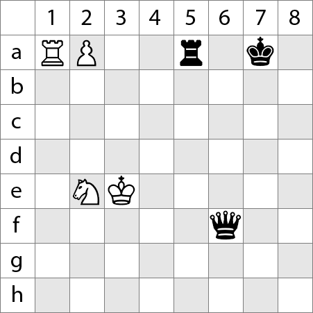

# chess-board-generator

The package is a showcase of a chess board generator.

An example of a chess board generator in PNG is below:

```
package main

import (
	Board "chess-board-generator.git"
)

func main() {

	step := 50

	Board.Init()

	Board.PlacePiece(50, 50, step, Board.WhiteTower)
	Board.PlacePiece(100, 50, step, Board.WhitePawn)
	Board.PlacePiece(250, 50, step, Board.BlackTower)
	Board.PlacePiece(100, 250, step, Board.WhiteHorse)
	Board.PlacePiece(150, 250, step, Board.WhiteKing)
	Board.PlacePiece(350, 50, step, Board.BlackKing)
	Board.PlacePiece(300, 300, step, Board.BlackQueen)

	Board.Save("test.png")

}
```

The result:
